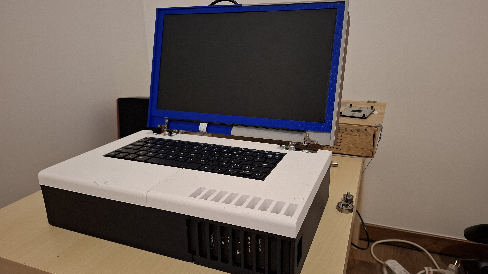
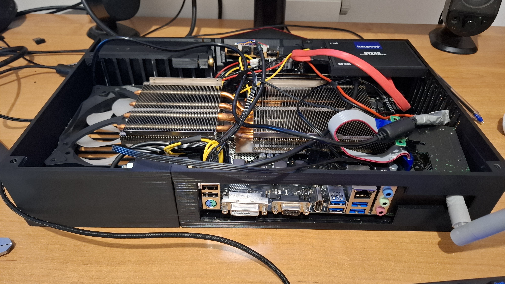

# laphorse
A 3D-printed case for using a microATX motherboard in a laptop form factor.

## Purpose
The goal of this project is to create reliable and practical laptop with desktop components.

## Required parts
1. An microATX motherboard
2. CPU with iGPU
3. RAM
4. m.2 or 2.5 inch disk
5. low profile CPU cooler
6. picoPSU (power dependent on chosen components)
7. 12v power supply (power dependent on chosen components)
8. slim keyboard (a lot of models may need slight design changes)
9. laptop hinges (I used ones from Lenovo 81wd, any other may require changes in the design)
10. PC power switch
11. 140mm fan
12. 15.6" laptop screen (dependent on model some slight design changes may be neccesary)
13. HDMI converter for your screen model
### Optional
1. low profile PCIe Wi-Fi card + PCIe riser

## Parts overview
1. cooling_bracket.stl - required only if you want to use old GPU cooler as your CPU cooler, dependent on chosen cooler and motherboard design changes may be neccesary).
2. keyboard.stl - cover for bottom part of the case.
3. lid_assembly.stl - all 3 parts of the lid.
4. main_case.stl - bottom part of the case where most of the hardware is mounted.
5. wifi_bracket.stl - required only if you use PCIe Wi-Fi card.

## How to print
1. keyboard.stl - Hinges may put a lot of stress on this part so I reccomend printing it with PETG.
2. lid_assembly.stl - Best to print it with PETG for the same reason as keyboard.stl.
3. main_case.stl - I printed it with ABS because cooler I used is relatively heavy, homever PLA could work with light coolers.
4. cooling_bracket.stl (optional)- It is recommended to print it with ABS because of high temps near the CPU cooler.
5. wifi_bracket.stl (optional) - Any material will do.

## Photos

